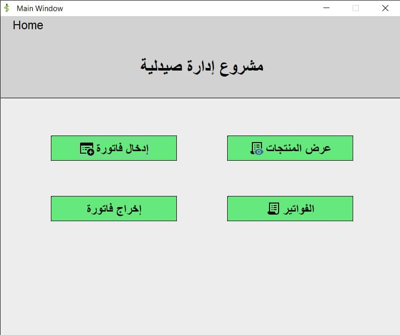
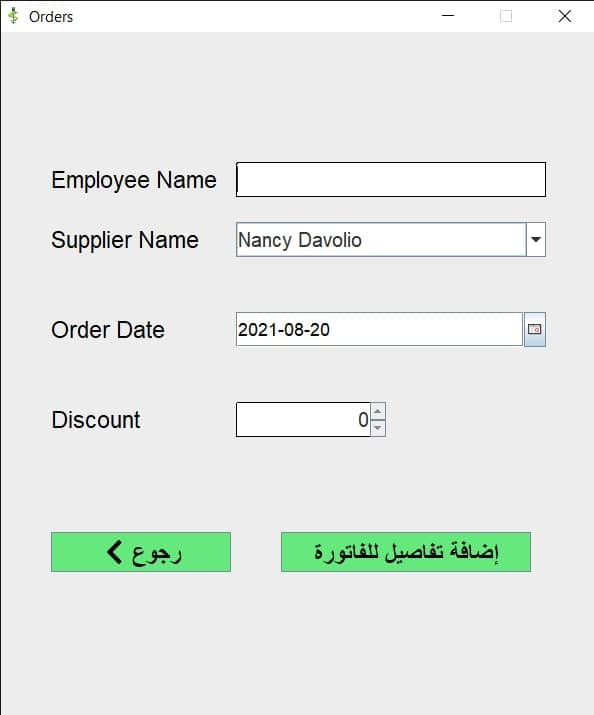

# About Pharmacy Project
A simple program to manage products in general and in particular for pharmacy products,
It is written in Java and there is an API also in Java,
Works on Windows  
It works fine but I forgot where I put the schema 😂
That's okay, I'll fix this problem.

### Here are some pictures of my program:

1. **When running, the main interface appears of course 🥲:**
    
    *   As you can see, I can view products, invoices, enter an invoice...
    
    *   There is a main menu to add employees (soon)

    

***
 

2. **Here I can add an invoice with simple details as shown:**

***
 

3. **It asks me to enter the invoice details completely:**

    * If the product is not in the warehouse, it will ask me to enter it and then complete the process
    
    * That's cool 😊

***
 

4. **This is a great masterpiece 😉, you can view products, add new products and modify them like this...:**

***
 

5. **Here you can view the details of the products and add or modify features and delete them of course 😁:**

***
 

6. **Don't forget this interface, it's important:**
    *   Display products in a beautiful layout
    *   You can search easily

***
 

7. **Finally you can see order details and search also 😊:**

 
